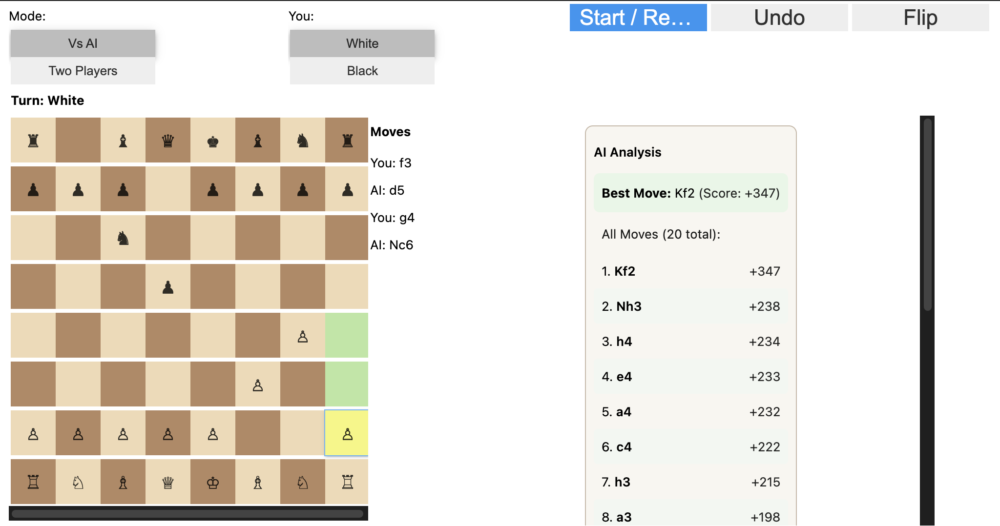
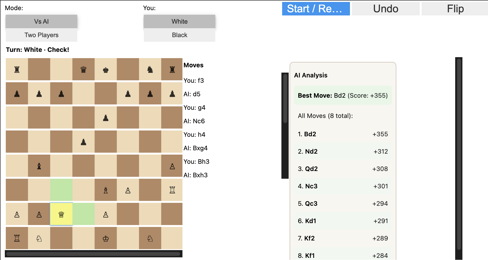
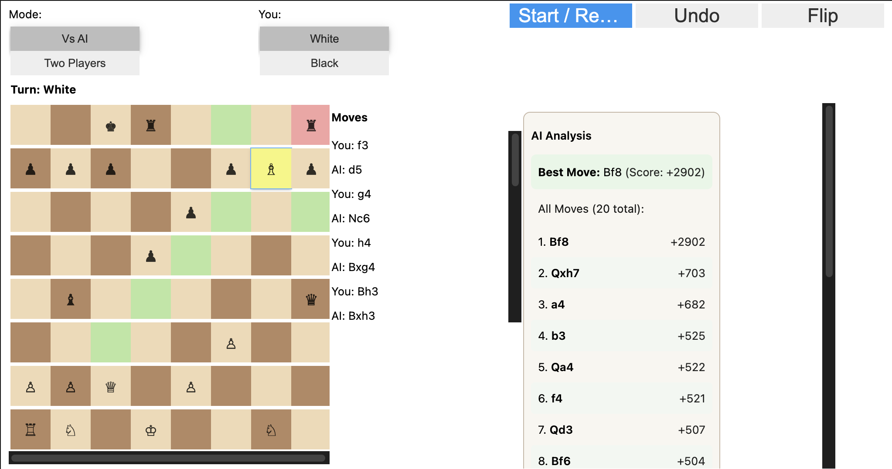
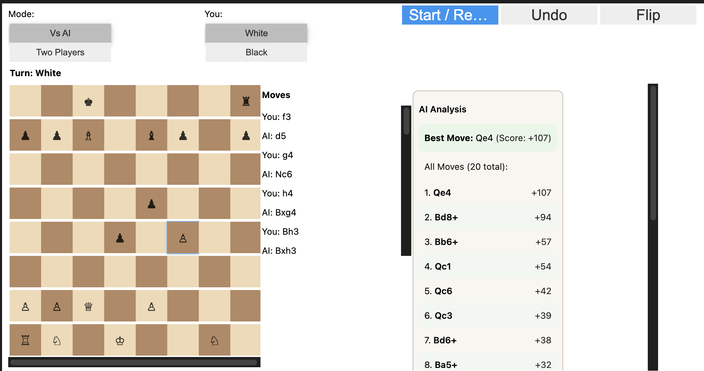

# Chess Machine Learning Evaluation System

A chess application that replaces the traditional Minimax algorithm with a machine learning model for position evaluation and move suggestion.

## Overview

This project implements an interactive chess game where an ML-trained neural network evaluates board positions and suggests optimal moves. Instead of using computationally expensive tree search (Minimax), the system leverages a trained MLP model to predict position evaluations in real-time.

### Key Features

- **ML-Based Evaluation**: Uses a trained neural network (MLP) to evaluate chess positions
- **1-Ply Move Selection**: Evaluates all legal moves and selects the best one
- **Interactive GUI**: Built with ipywidgets for Jupyter notebooks
- **Two Game Modes**: Play against AI or two-player mode
- **Real-Time Analysis**: Shows top 20 candidate moves with ML-predicted scores
- **Undo & Flip**: Rewind moves and change board perspective


## Project Structure

```text
Assignment2/
├── Chess_ML.ipynb                    # Main interactive chess application
├── ml_chess_engine.py                # ML evaluation engine (drop-in module)
├── train_chess_eval_model.py         # Training script for the MLP model
├── chess_eval_mlp.joblib             # Trained model
├── feature_config.json               # Feature metadata
├── chessData.csv                     # Kaggle chess evaluations dataset
└── README.md                         # This file
```


## How It Works

### Feature Representation

Chess positions are converted to a 781-dimensional feature vector:
- **12 piece planes** (6 per side × 64 squares): Binary encoding of piece placement
- **1 side-to-move bit**: Indicates whose turn it is
- **4 castling rights bits**: [K, Q, k, q] for both sides
- **8 en-passant bits**: One-hot encoding of en-passant file (a–h)

### Model Architecture

- **Input**: 781-dimensional feature vector
- **Hidden Layers**: [512, 256] neurons with ReLU activation
- **Output**: Single neuron predicting normalized evaluation (tanh space: [-1, 1])
- **Training**: MLPRegressor from scikit-learn with Adam optimizer

### Evaluation Pipeline

1. Convert FEN position → 781-d feature vector
2. Pass through trained MLP → tanh-normalized score (white's perspective)
3. Convert to current player's perspective
4. Optionally map back to centipawns using inverse tanh

## Installation & Usage

### Option 1: Use Pre-Trained Model


If you have the trained model (`chess_eval_mlp.joblib`), simply:

1. Ensure these files are in the same directory:
   - `Chess_ML.ipynb`
   - `ml_chess_engine.py`
   - `chess_eval_mlp.joblib`

2. Open `Chess_ML.ipynb` in Jupyter
3. Run cells from top to bottom:
   - First cell: Install dependencies (`!pip -q install chess ipywidgets`)
   - Second cell: Launch the interactive chess GUI

### Option 2: Train Your Own Model


If you want to train the model from scratch:

1. Download the [Kaggle Chess Evaluations Dataset](https://www.kaggle.com/datasets/ronakbadhe/chess-evaluations)
2. Place these files in the same directory:
   - `train_chess_eval_model.py`
   - `ml_chess_engine.py`
   - `chessData.csv` (the Kaggle dataset)

3. From terminal, run:
   ```bash
   python train_chess_eval_model.py --csv chessData.csv --sample 250000
   ```

   This will:
   - Sample 250,000 positions from the dataset
   - Train an MLP model
   - Save `chess_eval_mlp.joblib` and `feature_config.json`

4. Return to `Chess_ML.ipynb` and run the cells again

### Command-Line Options

```bash
python train_chess_eval_model.py \
  --csv chessData.csv \
  --sample 250000 \
  --hidden 512,256 \
  --max_iter 30 \
  --seed 42
```

- `--csv`: Path to the Kaggle CSV file
- `--sample`: Number of positions to sample (default: 250,000)
- `--hidden`: Hidden layer sizes, comma-separated (default: 512,256)
- `--max_iter`: Max training iterations (default: 30)
- `--seed`: Random seed (default: 42)


## Application Screenshots

### Screenshot 1: 




### Screenshot 2: 


### Screenshot 3: 




### Screenshot 4: 




### Screenshot 5: 



## Model Performance

The trained model achieves:

- **Test MSE (tanh-space)**: ~0.015–0.025 (varies with sample size)
- **Inference Speed**: <1ms per position on CPU
- **Training Time**: ~5–10 minutes on 250,000 samples (CPU)


## Technical Details

### Data Preparation

- **Source**: Kaggle Chess Evaluations Dataset (~8M positions)
- **Sampling**: Reservoir sampling for uniform distribution
- **Normalization**: Centipawns → tanh(eval/400) to map to [-1, 1]
- **Train/Test Split**: 90% train, 10% test

### Evaluation Metric

- **Mean Squared Error (MSE)** in tanh-normalized space
- Measures prediction accuracy of position evaluations

### Terminal Position Handling

- **Checkmate**: Assigned ±1e9 (extreme values)
- **Stalemate/Draw**: Assigned 0 (neutral)

## Dependencies

```text
python-chess>=1.9.0
scikit-learn>=1.0.0
numpy>=1.20.0
pandas>=1.3.0
joblib>=1.1.0
ipywidgets>=7.6.0
```

Install with:

```bash
pip install chess scikit-learn numpy pandas joblib ipywidgets
```


## File Descriptions

| File | Purpose |
|------|---------|
| `Chess_ML.ipynb` | Interactive Jupyter notebook with chess GUI |
| `ml_chess_engine.py` | Core ML evaluation module (importable) |
| `train_chess_eval_model.py` | Training script for the MLP model |
| `chess_eval_mlp.joblib` | Serialized trained MLP model |
| `feature_config.json` | Feature metadata (vector length, normalization params) |

## How to Play

1. **Start Game**: Click "Start / Reset"
2. **Select Mode**: Choose "Vs AI" or "Two Players"
3. **Choose Color**: If playing AI, select White or Black
4. **Make Moves**: Click a piece to select, then click a target square
5. **Pawn Promotion**: Choose a piece when a pawn reaches the last rank
6. **View Analysis**: Check the AI Analysis panel for top moves and scores
7. **Undo**: Click "Undo" to take back moves
8. **Flip Board**: Click "Flip" to change perspective


## References

- **Dataset**: [Kaggle Chess Evaluations](https://www.kaggle.com/datasets/ronakbadhe/chess-evaluations)
- **Chess Library**: [python-chess](https://python-chess.readthedocs.io/)
- **ML Framework**: [scikit-learn](https://scikit-learn.org/)

